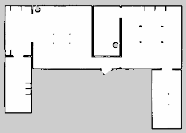
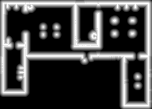

# ROS2 Turtlebot3 Localization

## Overview
This project implements sensor and motion models for a TurtleBot3 Burger robot within a ROS2 Jazzy environment. It focuses on map-based localization, LIDAR scan likelihood estimation, and distance field visualization to support probabilistic localization algorithms such as Monte Carlo Localization (MCL).

The `tb3_localization` ROS2 package provides nodes and utilities to:
* Generate and visualize distance fields from occupancy grid maps.
* Compute scan likelihoods from LIDAR data.
* Integrate motion and sensor models for localization testing and development.

**License**: MIT

## Prerequisites
* **Operating System**: Ubuntu 22.04 or later (recommended for ROS2 compatibility).
* **ROS2**: Jazzy distribution. Install from [official instructions](https://docs.ros.org/en/jazzy/Installation.html).
* **Gazebo**: Version 11 or later, installed via ROS2 (e.g., `ros-humble-gazebo-ros`).
* **Python Libraries**: After cloning, run:
  ```bash
  rosdep update
  rosdep install --from-paths src --ignore-src -r -y
  ```

## Installation
1. Clone the repository and initialize submodules:
    ```bash
    git clone https://github.com/HMC03/ros2-turtlebot3-localization.git
    cd ros2-turtlebot3-localization
    git submodule update --init --recursive
    ```

2. Source your ROS2 installation:
    ```bash
    source /opt/ros/jazzy/setup.bash
    ```

3. Build the workspace using colcon:
    ```bash
    colcon build --symlink-install
    ```

4. Source the workspace:
    ```bash
    source install/setup.bash
    ```

5. Define robot model:
    ```bash
    export TURTLEBOT3_MODEL=burger
    ```

## Repository Structure

```bash
ros2-turtlebot3-localization/
│
├── src/
│   └── tb3_localization/
│       ├── launch/                  # Launch files for map, RViz, Gazebo
│       ├── maps/                    # Saved maps (YAML + PGM/PNG)
│       ├── worlds/                  # Custom Gazebo world file
│       ├── tb3_localization/        # Core Python nodes
│       │   ├── motion_sensor_models.py
│       └── rviz/                    # Visualization configs
├── DynamixelSDK/, turtlebot3/, turtlebot3_msgs/, turtlebot3_simulations/ # Submodules for TurtleBot3 hardware and simulation support.
├── build/, install/, log/           # Generated by colcon (ignored)
└── README.md

```

## Usage
### Launching the Simulation

* Start the Gazebo simulation with the house environment:
    ```bash
    ros2 launch tb3_localization gz_tb3_house.launch.py
    ```
* Or launch with RViz for visualization:
    ```bash
    ros2 launch tb3_localization gz_rviz_tb3_house.launch.py
    ```

### Map Generation
Before running the motion and sensor models, you need a map of the environment.

1. **Launch Cartographer for SLAM**
    
    This allows the robot to create a map while you teleoperate it.
    ```bash
    ros2 launch turtlebot3_cartographer cartographer.launch.py
    ```

2. **Control the robot manually**

    Open a new terminal, source your workspace, and start teleoperation:
    ```bash
    ros2 run turtlebot3_teleop teleop_keyboard
    ```
    Use the keyboard to drive the robot around the environment until the map is complete.

3. **Save the map**

    Once mapping is finished, save it to your maps/ directory:
    ```bash
    ros2 run nav2_map_server map_saver_cli -f src/tb3_localization/maps/map
    ```
    This creates `map.pgm` and `map.yaml` in the maps/ folder.

4. **Convert the map to PNG for visualization**

    You can convert the .pgm file to .png using:
    ```bash
    convert src/tb3_localization/maps/map.pgm src/tb3_localization/maps/map.png
    ```

### Run Motion & Sensor Model Node
Runs LIDAR-based scan likelihood calculations and generates a distance field PNG from the loaded map.
```bash
ros2 run tb3_localization motion_sensor_models
```
Expected Output:
```less
[INFO] [motion_sensor_node]: Writing distance field to src/tb3_localization/maps/distance_field.png
[INFO] [motion_sensor_node]: scan likelihood (avg, beams subsampled) ~ 0.951
```
The distance field image will appear in:
```bash
src/tb3_localization/maps/distance_field.png
```

### Run Localization
```bash
ros2 run tb3_localization mcl_node
```

## Results

### Map


### Distance Field

